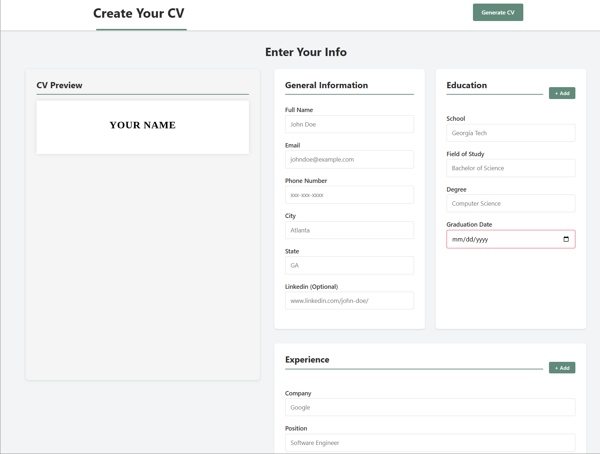

# 📄 CV Application Builder

A modern, interactive web application for creating professional CVs and resumes. Built with React and Vite, this project provides a real-time preview of your CV as you fill in your information, with the ability to print or save as PDF.

🔗 **[Live Demo](https://cv-app-9p8.pages.dev/)**



---

## 🌟 Features

- **Real-Time Preview**: See your CV update instantly as you type
- **Multiple Sections**:
  - General Information (name, contact details, location, LinkedIn)
  - Education (school, degree, field of study, graduation date)
  - Work Experience (company, position, responsibilities, dates)
- **Dynamic Entry Management**: Add or remove multiple education and experience entries
- **Form Validation**: Built-in validation with visual feedback for required fields
- **Professional Formatting**: Clean, print-ready CV layout with proper typography
- **Print & PDF Export**: Generate your CV as a PDF with a single click
- **Responsive Design**: Works seamlessly on desktop, tablet, and mobile devices
- **Live Preview Column**: Side-by-side form and preview for easy editing

---

## 🛠️ Technologies Used

- **React 19.2.0** - Component-based UI framework
- **Vite 7.1.9** - Fast build tool and dev server
- **CSS3** - Custom styling with modern features
- **React Hooks** - State management (useState)
- **ESLint** - Code quality and consistency
- **Browser Print API** - PDF generation

---

## 🚀 Getting Started

### Prerequisites

- Node.js (v20.19.0 or higher)
- npm or yarn package manager
- A modern web browser

### Installation

1. Clone the repository

```bash
git clone https://github.com/Abdirazakf/cv-app.git
```

2. Navigate to the project directory

```bash
cd cv-app
```

3. Install dependencies

```bash
npm install
```

4. Start the development server

```bash
npm start
```

5. Open your browser and visit `http://localhost:5173`

---

## 📖 Usage

1. **General Information**
   - Fill in your full name, email, phone number
   - Add your city and state
   - Optionally include your LinkedIn profile URL

2. **Education Section**
   - Enter your school name
   - Add your field of study and degree
   - Select your graduation date
   - Click "+ Add" to include multiple education entries
   - Remove entries using the "✕" button

3. **Experience Section**
   - Enter company name and position
   - Describe your responsibilities (supports multi-line text)
   - Set start and end dates for each position
   - Add multiple work experiences as needed
   - Remove entries using the "✕" button

4. **Generate PDF**
   - Click "Generate CV" in the header
   - Your CV will open in the print dialog
   - Choose "Save as PDF" as the destination
   - Save your professional CV

---

## 📁 Project Structure

```
cv-app/
│
├── index.html              # Main HTML entry point
├── package.json            # Project dependencies and scripts
├── vite.config.js         # Vite configuration
│
├── src/
│   ├── main.jsx           # React app entry point
│   │
│   ├── components/
│   │   ├── App.jsx        # Root component
│   │   ├── Header.jsx     # Header with Generate CV button
│   │   ├── MainBody.jsx   # Main content container
│   │   ├── Button.jsx     # Reusable button component
│   │   ├── CVPreview.jsx  # CV preview component
│   │   │
│   │   └── forms/
│   │       ├── GeneralInfo.jsx   # General info form
│   │       ├── Education.jsx     # Education entries form
│   │       └── Experience.jsx    # Work experience form
│   │
│   └── styles/
│       ├── reset.css      # CSS reset
│       ├── index.css      # Global styles & print styles
│       ├── form.css       # Form styling
│       ├── Button.css     # Button variants
│       └── resume.css     # CV preview styling
│
└── README.md              # Project documentation
```

---

## 💻 Code Overview

### State Management

```javascript
const [cvData, setData] = useState({
    generalInfo: { fullName: '', email: '', phoneNumber: '', city: '', state: '', linkedin: '' },
    education: [{ id: 1, school: '', field: '', degree: '', gradDate: '' }],
    experience: [{ id: 1, company: '', position: '', responsibilities: '', startDate: '', endDate: '' }]
})
```

### Key Components

- **App.jsx**: Root component that combines Header and MainBody
- **MainBody.jsx**: Manages all CV data state and provides update functions to child components
- **CVPreview.jsx**: Renders the formatted CV in real-time based on current data
- **GeneralInfo/Education/Experience**: Form components for each CV section

---

## 🎨 Customization

### Styling

- Modify colors in `src/styles/index.css` by updating CSS variables:

```css
:root {
    --heading-color: #2b2b2c;
    --accent-color: #618a7b;
    --main-color: #f2f3f4e8;
}
```

### CV Layout

- Edit `src/styles/resume.css` to customize the CV appearance
- Adjust spacing, fonts, and formatting as needed

---

## 🤝 Contributing

Contributions, issues, and feature requests are welcome! Feel free to check the issues page.

---

## 📝 License

This project is open source and available under the [MIT License](LICENSE).

---

## 👤 Author

**Abdirazak Farah**

- GitHub: [@Abdirazakf](https://github.com/Abdirazakf)

---

## 🙏 Acknowledgments

- Font: [Tinos](https://fonts.google.com/specimen/Tinos) from Google Fonts
